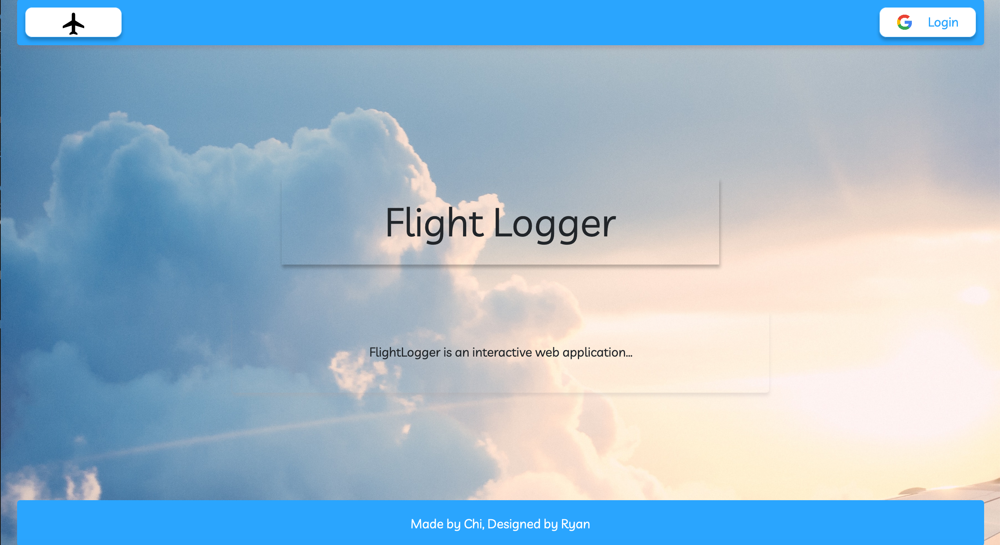

# flight-log-book

## About:
FlightLogger is an interactive web application for student pilots to record and track lesson progress as an accessory to a personal flight scheduler.
Log in with your google account and add a lesson with the Add Lesson Button.

## [Link to Site](https://sei-flight-logger.herokuapp.com/students)

## Tools and Framworks Used: 
Express, Nodejs, JS, CSS, BootStrap, HTML, PassportJS, OAuth2, MongoDB and deployed on Heroku 

## Purpose of Project
To implement CRUD method, have user sign in with OAuth2, and use frameworks and tools above

## TODO and STRETCHGOALS:

- [ ] Finish my flight hours logic
- [ ] Make Site Responsive 
- [ ] Fix Date Format with Moment
- [ ] Add more styling to give it a paper-like feel through noise texture
- [ ] Webscrape Syllabus from AOPA to checkoff goals as you input your lesson categories
- [ ] Weather API to grab weather data on certain flight dates
- [ ] Allow user to upload photos